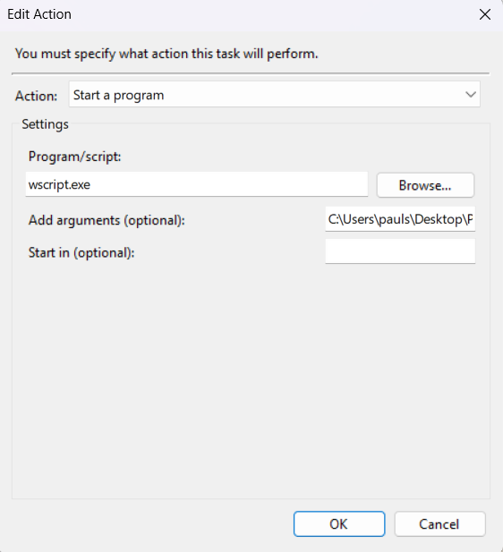

# Windows Dark Mode Scheduler

Automatically switch Windows between light and dark mode using local sunrise
and sunset times.

The theme check is launched by Windows Task Scheduler. The PowerShell script
uses [IP-API](https://ip-api.com/) to estimate your location and
[Sunrise-Sunset.org](https://sunrise-sunset.org/api) to retrieve today's
sunrise and sunset. It then calls the Python theme script with either `light`
or `dark`.

## How it works

```text
Task Scheduler
    ↓
launch_hidden.vbs
    ↓
sun_theme.ps1
    ↓
IP-API → latitude and longitude
    ↓
Sunrise-Sunset.org → sunrise and sunset
    ↓
windows_theme.py light | dark
    ↓
Windows theme preference and refresh notifications
```

The VBS file starts PowerShell without displaying a console window. The
PowerShell script performs one theme check and exits. Task Scheduler launches
it again at the configured interval.

## Requirements

- Windows 10 or Windows 11
- Python 3
- The Windows Python launcher (`py.exe`)
- Windows PowerShell
- Internet access

No third-party Python packages are required.

## Project files

```text
Windows-Dark-Mode-Scheduler/
├── launch_hidden.vbs
├── sun_theme.ps1
├── windows_theme_vibecoded.py
└── README.md
```

Keep the three scripts together in the same directory.

## Installation

### 1. Download the project

Clone this repository:

```powershell
git clone <repository-url>
```

Alternatively, use **Code → Download ZIP** on GitHub and extract the archive to
a permanent location.

Do not leave the project in a temporary directory. Task Scheduler stores the
full path to `launch_hidden.vbs`, so moving the directory later will break the
task until its action is updated.

### 2. Verify Python

Open PowerShell and run:

```powershell
py --version
```

If Windows reports that `py` cannot be found, install Python and ensure that
the Python launcher is included.

You can test the theme script directly:

```powershell
py .\windows_theme_vibecoded.py light
py .\windows_theme_vibecoded.py dark
```

### 3. Configure the hidden launcher

`launch_hidden.vbs` should contain:

```vbscript
Set shell = CreateObject("WScript.Shell")
Set files = CreateObject("Scripting.FileSystemObject")

scriptDirectory = files.GetParentFolderName(WScript.ScriptFullName)
powerShellScript = scriptDirectory & "\sun_theme.ps1"

command = "powershell.exe -NoProfile -NonInteractive -ExecutionPolicy Bypass -File """ & powerShellScript & """"

shell.Run command, 0, False
```

This determines the project directory from the location of the VBS file, so no
PowerShell path needs to be hard-coded inside the launcher.

Ensure the file is actually named `launch_hidden.vbs`, not
`launch_hidden.vbs.txt`. In File Explorer, enable **View → Show → File name
extensions** if necessary.

### 4. Open Task Scheduler

Press <kbd>Win</kbd> + <kbd>R</kbd>, enter:

```text
taskschd.msc
```

Then press <kbd>Enter</kbd>.

Select **Create Task…** in the Actions panel. Give the task a recognizable name,
such as `NightMode`.

### 5. Configure the General tab

Use these settings:

- Select your normal Windows user account.
- Select **Run only when user is logged on**.
- Leave **Run with highest privileges** disabled.
- Set **Configure for** to your installed Windows version.

The task must run as the interactive user. The project modifies
`HKEY_CURRENT_USER` and sends refresh notifications to that user's Explorer
session. Do not run it as `SYSTEM`.

### 6. Add the action

Open the **Actions** tab and select **New…**.

Configure:

| Field | Value |
| --- | --- |
| Action | `Start a program` |
| Program/script | `C:\Windows\System32\wscript.exe` |
| Add arguments | `"C:\full\path\to\launch_hidden.vbs"` |
| Start in | The project directory, without quotation marks |

`wscript.exe` must receive the `.vbs` file—not `sun_theme.ps1`. Windows Script
Host cannot execute a PowerShell script directly.



### 7. Add the trigger

Open the **Triggers** tab and select **New…**.

Configure:

- **Begin the task:** `On a schedule`
- Select **Daily**.
- Set **Start** to today at `12:00:00 AM`.
- Enable **Repeat task every:** `10 minutes`.
- Set **for a duration of:** `1 day`.
- Ensure **Enabled** is selected.

The trigger starts again each day and repeats the check every ten minutes. A
theme transition can therefore occur up to ten minutes after the actual
sunrise or sunset. Choose a shorter interval if you want a more precise
transition.

### 8. Configure conditions and recovery

On laptops, open the **Conditions** tab and disable **Start the task only if the
computer is on AC power** if you want theme changes while running on battery.

On the **Settings** tab:

- Enable **Allow task to be run on demand**.
- Enable **Run task as soon as possible after a scheduled start is missed**.
- For **If the task is already running**, select **Do not start a new instance**.

Select **OK** to save the task.

## Testing

In Task Scheduler Library, find `NightMode`, right-click it, and select **Run**.
No PowerShell window should appear.

Confirm that:

1. The task's **Last Run Result** does not show a Task Scheduler error.
2. The registry values under the following key match the expected theme:

   ```text
   HKEY_CURRENT_USER\Software\Microsoft\Windows\CurrentVersion\Themes\Personalize
   ```

3. `AppsUseLightTheme` and `SystemUsesLightTheme` are `1` during daylight and
   `0` outside daylight hours.

You can also run the PowerShell checker visibly while debugging:

```powershell
powershell.exe -NoProfile -ExecutionPolicy Bypass -File .\sun_theme.ps1
```

## Troubleshooting

### “There is no script engine for file extension .ps1”

Task Scheduler is passing `sun_theme.ps1` directly to `wscript.exe`. Change the
action so its argument is the full path to `launch_hidden.vbs`.

### A PowerShell window appears briefly

Confirm that Task Scheduler launches `wscript.exe` and not `powershell.exe`.
Also verify that `launch_hidden.vbs` uses:

```vbscript
shell.Run command, 0, False
```

The `0` requests a hidden window.

### Python or `py.exe` cannot be found

Run this from PowerShell:

```powershell
Get-Command py.exe
```

If it cannot be found, reinstall Python with the launcher enabled, or replace
`py.exe` in `sun_theme.ps1` with the full path to your Python executable.

### The task works manually but not on schedule

- Confirm that the task runs as your normal user, not `SYSTEM`.
- Confirm that the project has not been moved since creating the task.
- Check the task's **History** tab for failures.
- Verify that both web services are reachable.
- Check whether PowerShell execution is restricted by organization policy.

### The secondary taskbar uses the wrong theme

Explorer sometimes retains cached theme resources for the taskbar on another
monitor. Toggle **Settings → Personalization → Taskbar → Taskbar behaviors →
Show my taskbar on all displays** off and on, or restart Windows Explorer.

The broadcast reaches top-level Explorer windows, but applications are
responsible for refreshing their own UI. There is no documented API for
refreshing only the secondary taskbar.

## Privacy and external services

The current location request uses the free HTTP endpoint from IP-API. Your
public IP address is visible to that service, and the connection is not
encrypted. IP-based location can also be inaccurate when using a VPN, mobile
network, corporate gateway, or privacy relay.

The resulting coordinates are sent to Sunrise-Sunset.org. If you prefer, you
can remove the IP lookup and configure fixed latitude and longitude values in
`sun_theme.ps1`.

Review the services before use:

- [IP-API](https://ip-api.com/)
- [Sunrise-Sunset API](https://sunrise-sunset.org/api)

## Limitations

- The PowerShell script performs one check and exits; scheduling is currently
  provided by Windows Task Scheduler.
- An internet connection is needed unless solar times are calculated locally.
- IP geolocation is approximate.
- Some applications manage their own theme or ignore refresh notifications.
- Explorer may keep cached theme resources until it is restarted. (Example: Taskbar on the secondary screen )
- VBScript is deprecated by Microsoft and is used here only as a small hidden
  launcher. A future compiled background application should replace it.

If VBScript is unavailable, configure Task Scheduler to launch
`powershell.exe` directly with these arguments:

```text
-NoProfile -NonInteractive -WindowStyle Hidden -ExecutionPolicy Bypass -File "C:\full\path\to\sun_theme.ps1"
```

## Acknowledgements

- Location data from [IP-API](https://ip-api.com/)
- Solar data from [Sunrise-Sunset.org](https://sunrise-sunset.org/api)
- Windows messaging documentation from
  [Microsoft Learn](https://learn.microsoft.com/en-us/windows/win32/winmsg/about-messages-and-message-queues)

## Contributing

Issues and pull requests are welcome, especially reports covering different
Windows 10 and Windows 11 builds or multi-monitor configurations.

## Future Work

- Offline mode to eradicate dependency on external api's 
- Secondary Screen Taskbar Fix 